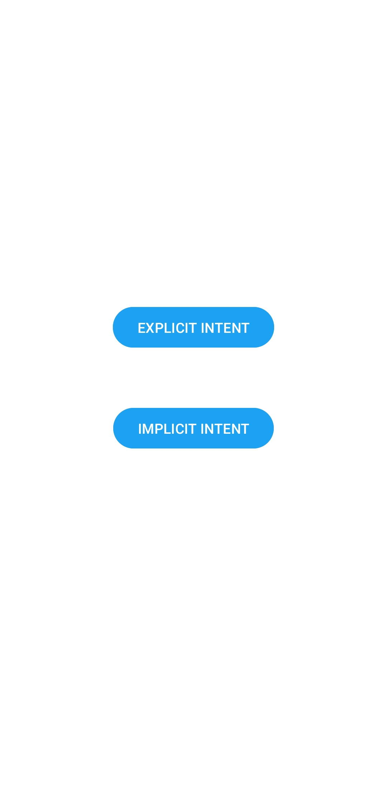

## Splash Screen App  
### Exemplo de Splash Screen e Intent Explícito e Implícito no Android

 #### O que foi usado no projeto 
  - Splash Screen API do Android com a adição da dependência necessária no arquivo build.gradle.kts    
  - Vector Asset para criação da imagem da splash screen e adicionado no arquivo themes.xml dentro da pasta values.       
  - O intent implícito vai para pudim.com.br

  
  
  

